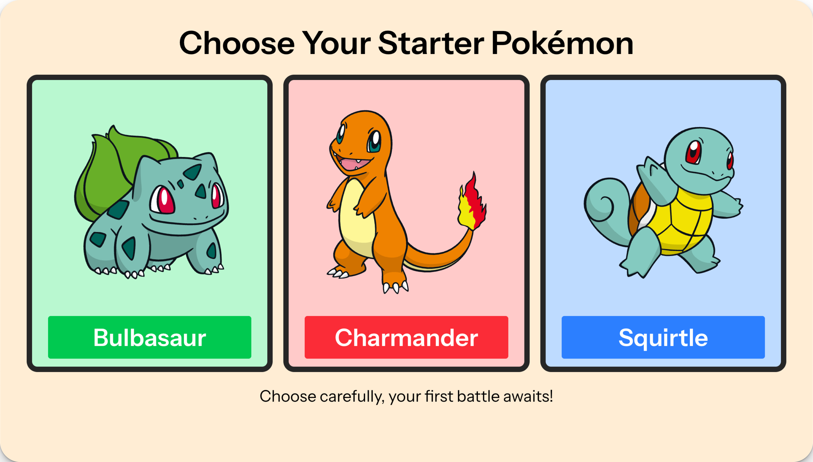

# PokeRPS
A Laravel example application - Select your Gen I starter Pokemon in a game of Rock Paper Scissors.

---



## Local Development

To run the development server locally, you will need to have the following prerequisites installed:

 - [PHP 8.4+](https://www.php.net/)
 - [Composer 2.8+](https://getcomposer.org/)
 - [Node.js 18+](https://nodejs.org/en/) *(or your actual tested version)*
 - [pnpm](https://pnpm.io/installation)

 When you have all of the prerequisites installed, you can run the development server with the following commands:

```bash
composer install
pnpm install
pnpm dev
```

